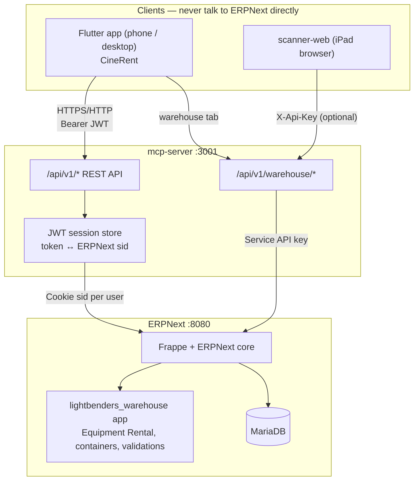

# CineRent — System Guide

How the film equipment rental app works end-to-end. Read this to understand what you saw on the dashboard (e.g. **2 active rentals**, **28 available**) and where to debug.

---

## Short answer: is it real ERPNext data?

**Yes.** Every number and list in the Flutter app comes from **ERPNext** via **mcp-server**. There is no Supabase or local fake database anymore.

| What you see in the app | ERPNext source |
|-------------------------|----------------|
| 2 active rentals | `Equipment Rental` docs with `status = Active` |
| 28 available | Serialized items **not** on an active rental (computed from `Item` + `Serial No` + active rentals) |
| Equipment list | `Item` |
| Clients | `Customer` |
| Rental lines | `Equipment Rental Item` (child table) |
| Warehouse audit | `Warehouse Container` + stock in container warehouse |

Change data in ERPNext desk → refresh the app → numbers update.

---

## Architecture (one picture)



**Rule:** Flutter and scanner-web only call **mcp-server**. ERPNext URL and API secrets stay on the server.

---

## The three layers

### 1. Flutter app (`lib/`)

Thin client. Responsibilities:

- Login UI, lists, forms, warehouse scan UI
- Stores **MCP JWT** in secure storage (not ERPNext password long-term)
- HTTP to `{MCP_BASE_URL}/api/v1/...`

**Important on a physical phone:** `MCP_BASE_URL` must be your PC’s LAN IP (e.g. `http://192.168.1.74:3001`), not `localhost`.

Layer inside Flutter:

```
screens/  → UI
providers/ → Riverpod state
repositories/ → MCP HTTP calls
models/ → JSON ↔ Dart objects
core/mcp_client.dart → auth + requests + errors
```

### 2. MCP server (`mcp-server/`)

Single integration API. Two auth modes:

| Route group | Auth | Used by |
|-------------|------|---------|
| `/api/v1/auth/*`, `/items`, `/customers`, `/rentals`, `/dashboard/*` | **JWT** (from ERPNext login) | Flutter office app |
| `/api/v1/warehouse/*` | **X-Api-Key** (if `MCP_API_KEY` set in `.env`) | Flutter warehouse tab, scanner-web |

On login, MCP:

1. Calls ERPNext `POST /api/method/login` with username/password
2. Stores ERPNext `sid` server-side, mapped to a signed JWT
3. Returns JWT to Flutter

On each Flutter request, MCP validates JWT → loads `sid` → forwards to ERPNext REST API.

Contract (stable error codes, paths): **`docs/api-v1.md`**

### 3. ERPNext + `lightbenders_warehouse`

System of record. Custom Frappe app adds:

- **Equipment Rental** + **Equipment Rental Item** (serialized + qty lines)
- Validations: no double-booked serials, qty ≤ stock at rental warehouse
- **Warehouse Container**, assembly expansion, audit/dispatch/return stock moves
- Customer field `id_document`

Desk: http://localhost:8080 · Site name: **`frontend`**

---

## Auth flow (Flutter login)

```
Phone                    MCP                         ERPNext
  │  POST /api/v1/auth/login                         │
  │  { username, password }                          │
  ├──────────────────────►│  POST /api/method/login   │
  │                       ├──────────────────────────►│
  │                       │◄──────── sid + user ──────┤
  │◄── { access_token } ──┤  (sid kept on server)     │
  │                       │                            │
  │  GET /api/v1/rentals  │                            │
  │  Authorization: Bearer│  Cookie: sid=...           │
  ├──────────────────────►├──────────────────────────►│
  │◄── { ok, data } ──────┤◄───────────────────────────┤
```

Flutter **never** sees ERPNext `sid`, `ERPNEXT_API_KEY`, or `ERPNEXT_API_SECRET`.

Session expiry → MCP returns `SESSION_EXPIRED` → app sends user back to login.

---

## Screen → API → ERPNext mapping

| App tab | MCP endpoint | ERPNext |
|---------|--------------|---------|
| Login | `POST /auth/login` | User login |
| Dashboard | `GET /dashboard/stats` | Count Active/Overdue rentals; available serials |
| Equipment list | `GET /items` | `Item` |
| Equipment detail | `GET /items/:code` | `Item`, `Serial No`, stock balance |
| Equipment form | `POST/PATCH /items`, `POST /serials` | `Item`, `Serial No` |
| Clients | `GET/POST/PATCH /customers` | `Customer` |
| Rentals list | `GET /rentals` | `Equipment Rental` |
| Rental detail | `GET /rentals/:name`, return, damage | `Equipment Rental` + methods |
| Rental form | `POST /rentals` + `/submit` | Create + submit doc |
| Warehouse audit | `POST /warehouse/audit` | Container expected vs actual stock |
| Warehouse dispatch/return | `POST /warehouse/session/*` | In-memory session → Stock Entry |

---

## Dashboard numbers explained

`GET /api/v1/dashboard/stats` returns:

```json
{
  "active_rentals": 2,
  "overdue_rentals": 0,
  "available_serialized": 28,
  "item_count": 42
}
```

- **active_rentals** — ERPNext count where `Equipment Rental.status = Active`
- **overdue_rentals** — `status = Overdue`
- **available_serialized** — serial numbers not referenced on any Active rental (per-item scan of serials)
- **item_count** — non-disabled `Item` rows

`todayRevenue` in the UI is currently **0** (not wired to ERPNext yet).

---

## Warehouse vs office rentals

Two workflows, same MCP server:

| Workflow | Who | Lines |
|----------|-----|-------|
| **Office rentals** | Flutter Equipment/Clients/Rentals | JWT auth, `Equipment Rental` DocType |
| **Floor operations** | Flutter Warehouse tab or scanner-web | Container audit, scan serials, Stock Entry |

Hybrid inventory model:

- **Serialized** — barcodes = `Serial No`; one serial per rental line
- **Qty** — sandbags etc.; quantity from stock at **Main Store Floor - {company abbr}**

---

## Local dev topology (your machine)

| Service | URL | Role |
|---------|-----|------|
| ERPNext | http://localhost:8080 | Database + desk |
| MCP | http://localhost:3001 | API bridge |
| MCP (from phone) | http://192.168.1.74:3001 | Same server, LAN IP |
| Flutter | Android device | MCP client only |

**Start order:**

1. Docker ERPNext (`frappe_docker/pwd.yml`)
2. `cd mcp-server && npm run dev`
3. `make run` (Flutter with LAN MCP URL)

Details: **`docs/local-dev-runbook.md`**

**Login (dev):** ERPNext user e.g. `Administrator` / `admin` — not old Supabase email unless you created that user in ERPNext.

---

## Debugging cheat sheet

| Symptom | Check |
|---------|--------|
| Network error on phone | Phone on same Wi‑Fi? MCP URL = PC LAN IP, not localhost |
| Login fails | `curl -X POST localhost:3001/api/v1/auth/login -d '{"username":"Administrator","password":"admin"}'` |
| Wrong counts | ERPNext desk → Equipment Rental / Serial No; compare to `GET /dashboard/stats` with JWT |
| 401 SESSION_EXPIRED | Re-login; MCP JWT TTL in `mcp-server/.env` |
| Warehouse fails | `curl -X POST localhost:3001/api/v1/warehouse/audit -H 'Content-Type: application/json' -d '{"container_barcode":"TRAY-004"}'` |
| Rental submit blocked | Expected: `SERIAL_ALREADY_RENTED` or `INSUFFICIENT_QTY` from MCP |
| MCP down | `curl localhost:3001/health` |
| ERPNext down | `curl localhost:8080/api/method/ping` |

**Logs:**

- MCP: terminal running `npm run dev`
- ERPNext: `docker logs frappe_docker-backend-1`
- Flutter: `flutter run` console / DevTools

**Verify data at source:**

```bash
# MCP login → save token
TOKEN=$(curl -s -X POST http://localhost:3001/api/v1/auth/login \
  -H 'Content-Type: application/json' \
  -d '{"username":"Administrator","password":"admin"}' \
  | python3 -c "import sys,json; print(json.load(sys.stdin)['data']['access_token'])")

curl -s http://localhost:3001/api/v1/dashboard/stats \
  -H "Authorization: Bearer $TOKEN"
```

---

## Repo map (what lives where)

```
inventorymanagement/
├── lib/                    Flutter app (CineRent)
├── mcp-server/             TypeScript Express + MCP tools
├── lightbenders_warehouse/   Frappe app (schema, validations, seed)
├── scanner-web/            iPad warehouse UI (legacy /api/* paths)
├── docs/
│   ├── api-v1.md           API contract (source of truth)
│   └── local-dev-runbook.md
├── flutter_erpnextmcp.md   Phase plan U0–U6
└── guide.md                ← this file
```

---

## What was removed (don’t look for it)

- **Supabase** — prototype only; removed from Flutter in U4
- Old login (`aayam.neupane1@gmail.com` etc.) — Supabase Auth, not in ERPNext unless you create that User in desk

---

## Explaining it in one sentence

> **CineRent is a Flutter front-end; mcp-server is the API and session layer; ERPNext is the only database and business rules engine — everything you see on the dashboard is live ERPNext data.**

For API details → **`docs/api-v1.md`**. For setup → **`docs/local-dev-runbook.md`**. For implementation phases → **`flutter_erpnextmcp.md`**.
